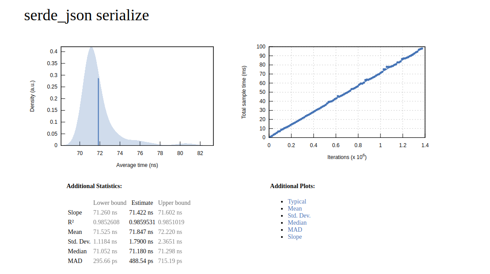
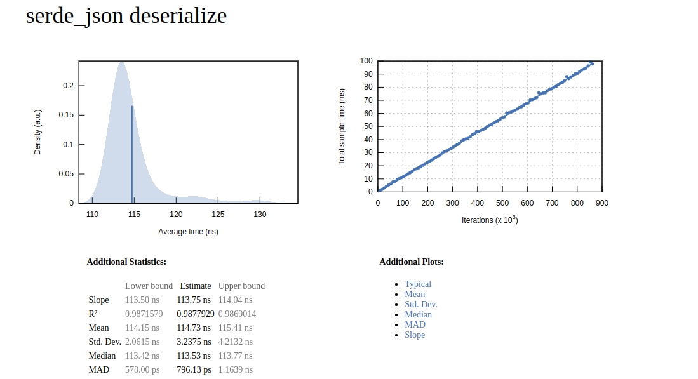

# Rust Serializers Comparison

A benchmarking project that compares the performance and memory usage of various Rust serialization libraries.

## Overview

This project provides benchmarks for comparing different serialization formats in Rust, including:

- [Bincode](https://github.com/bincode-org/bincode) - A binary serialization format designed for Rust
- [BCS](https://github.com/diem/bcs) (Binary Canonical Serialization) - A serialization format created for the Diem blockchain
- [Protocol Buffers](https://github.com/stepancheg/rust-protobuf) - Google's language-neutral, platform-neutral extensible mechanism
- [Serde JSON](https://github.com/serde-rs/json) - A JSON serialization format using Serde
- [Borsh](https://github.com/near/borsh-rs) - Binary Object Representation Serializer for Hashing

The benchmarks measure both performance (speed) and memory usage for serialization and deserialization operations.

## Features

- Benchmark serialization and deserialization speed using Criterion
- Track memory allocation during serialization and deserialization
- Compare binary and text-based serialization formats
- Detailed performance reports

## Project Structure

```
├── benches
│   ├── message.rs           # Generated Protocol Buffers code
│   ├── mod.rs               # Module definitions
│   ├── serialization_benchmark.rs  # Main benchmark code
│   └── trallocator.rs       # Memory tracking allocator
├── Cargo.lock
├── Cargo.toml
└── src
    ├── main.rs              # Main application entry point
    └── proto
        └── message.proto    # Protocol Buffers definition file
```

## Prerequisites

- Rust (stable channel)
- Protocol Buffers compiler (`protoc`)
- Cargo and Rust's package manager

## Setup

1. **Clone the repository**:
   ```bash
   git clone https://github.com/wdcs-pruthvithakor/rust-serializers-comparison.git
   cd rust-serializers-comparison
   ```

2. **Generate Protocol Buffers Rust code**:
   To generate the `message.rs` file from the `message.proto` file, use the following command:
   ```bash
   protoc --rs_out=benches/ --proto-path=src/proto src/proto/message.proto
   ```

## Running the Benchmarks

Run all benchmarks with:

```bash
cargo bench
```

The benchmarks will output results to the console, showing both performance metrics and memory usage statistics for each serialization format.

## Memory Tracking and Benchmarking

The project uses a custom memory allocator (`Trallocator`) to track memory usage during the serialization and deserialization operations. The `MemoryTracker` struct logs the memory usage at three stages:
1. Before serialization
2. After serialization
3. After deserialization

This information is printed out to give insights into the memory overhead introduced by different serialization formats.

## Benchmark Operations

Each of the following operations is benchmarked:

1. **Bincode**
   - Bincode is a highly efficient binary serialization format.
   - Measures the memory used during serialization and deserialization of a `TestData` instance.

2. **BCS (Binary Canonical Serialization)**
   - Used by the Move language, BCS is a binary serialization format.
   - Measures the memory used during serialization and deserialization.

3. **Protobuf**
   - Protocol Buffers, a widely used language-neutral, platform-neutral format.
   - Protobuf's performance is measured by serializing and deserializing a `TestData` message.

4. **Serde JSON**
   - JSON format via the `serde` framework.
   - Benchmarks the time and memory used to serialize and deserialize the `TestData` struct to and from JSON.

5. **Borsh**
   - Borsh is a binary serialization format optimized for Rust.
   - Measures the performance of serializing and deserializing the `TestData` struct.


## Understanding the Results

The benchmark results include:

- **Speed**: Time taken for serialization and deserialization operations
- **Memory Usage**: How much memory is allocated during serialization and deserialization
- **Comparison**: Relative performance between different serialization libraries

Example output:

```
--- Bincode ---
Memory before: 0 bytes
Memory after serialize: X bytes
Memory after deserialize: Y bytes
Memory used during Bincode: Z bytes
---------------------
```

## Example Results

```bash
Running benches/serialization_benchmark.rs (target/release/deps/serialization_benchmark-f69eddaa2292a108)
bincode serialize       time:   [29.186 ns 29.284 ns 29.394 ns]
                        change: [-5.7868% -5.2209% -4.6099%] (p = 0.00 < 0.05)
                        Performance has improved.
Found 15 outliers among 100 measurements (15.00%)
  9 (9.00%) high mild
  6 (6.00%) high severe

bincode deserialize     time:   [73.928 ns 74.097 ns 74.281 ns]
                        change: [-4.8341% -4.2228% -3.6148%] (p = 0.00 < 0.05)
                        Performance has improved.
Found 10 outliers among 100 measurements (10.00%)
  5 (5.00%) high mild
  5 (5.00%) high severe

--- Bincode ---
Memory before: 0 bytes
Memory after serialize: 34266 bytes
Memory after deserialize: 38 bytes
Memory used during Bincode: 34304 bytes
---------------------

bcs serialize           time:   [68.777 ns 68.916 ns 69.076 ns]
                        change: [-6.3500% -5.8003% -5.2386%] (p = 0.00 < 0.05)
                        Performance has improved.
Found 13 outliers among 100 measurements (13.00%)
  4 (4.00%) high mild
  9 (9.00%) high severe

bcs deserialize         time:   [134.66 ns 134.93 ns 135.25 ns]
                        change: [-9.2977% -8.5199% -7.8080%] (p = 0.00 < 0.05)
                        Performance has improved.
Found 15 outliers among 100 measurements (15.00%)
  6 (6.00%) high mild
  9 (9.00%) high severe

--- BCS ---
Memory before: 0 bytes
Memory after serialize: 26 bytes
Memory after deserialize: 230 bytes
Memory used during BCS: 256 bytes
---------------------

protobuf serialize      time:   [66.557 ns 66.693 ns 66.843 ns]
                        change: [-4.2811% -3.6905% -3.0785%] (p = 0.00 < 0.05)
                        Performance has improved.
Found 9 outliers among 100 measurements (9.00%)
  6 (6.00%) high mild
  3 (3.00%) high severe

protobuf deserialize    time:   [81.161 ns 81.472 ns 81.807 ns]
                        change: [-5.0820% -4.4722% -3.7608%] (p = 0.00 < 0.05)
                        Performance has improved.
Found 14 outliers among 100 measurements (14.00%)
  7 (7.00%) high mild
  7 (7.00%) high severe

--- Protobuf ---
Memory before: 0 bytes
Memory after serialize: 46 bytes
Memory after deserialize: 40 bytes
Memory used during Protobuf: 86 bytes
---------------------

serde_json serialize    time:   [71.260 ns 71.422 ns 71.602 ns]
                        change: [-7.2006% -6.5492% -5.8745%] (p = 0.00 < 0.05)
                        Performance has improved.
Found 11 outliers among 100 measurements (11.00%)
  4 (4.00%) high mild
  7 (7.00%) high severe

serde_json deserialize  time:   [113.50 ns 113.75 ns 114.04 ns]
                        change: [-1.0152% -0.3046% +0.4558%] (p = 0.42 > 0.05)
                        No change in performance detected.
Found 11 outliers among 100 measurements (11.00%)
  4 (4.00%) high mild
  7 (7.00%) high severe

--- Serde JSON ---
Memory before: 0 bytes
Memory after serialize: 40 bytes
Memory after deserialize: 444 bytes
Memory used during Serde JSON: 484 bytes
---------------------

borsh serialize         time:   [31.745 ns 31.815 ns 31.896 ns]
                        change: [-4.0058% -3.5591% -3.0194%] (p = 0.00 < 0.05)
                        Performance has improved.
Found 11 outliers among 100 measurements (11.00%)
  7 (7.00%) high mild
  4 (4.00%) high severe

borsh deserialize       time:   [69.856 ns 70.025 ns 70.222 ns]
                        change: [-5.8331% -5.2309% -4.6125%] (p = 0.00 < 0.05)
                        Performance has improved.
Found 15 outliers among 100 measurements (15.00%)
  6 (6.00%) high mild
  9 (9.00%) high severe

--- Borsh ---
Memory before: 0 bytes
Memory after serialize: 30 bytes
Memory after deserialize: 34 bytes
Memory used during Borsh: 64 bytes
---------------------


```

## Visual Example




## Conclusion

This project serves as a benchmark comparison of several serialization formats used in Rust, providing insights into which format might be best suited for your use case based on both performance and memory efficiency. The project can be extended to include additional serialization formats or refined to add more specific benchmarking metrics.

## Contributing

Contributions are welcome! Here are some ways you can contribute:

- Add benchmarks for additional serialization formats
- Improve the benchmarking methodology
- Enhance documentation
- Report issues or suggest improvements

## License

[MIT License](LICENSE)

## Acknowledgements

- This project uses [Criterion](https://github.com/bheisler/criterion.rs) for benchmarking
- Special thanks to all the developers of the serialization libraries being compared

